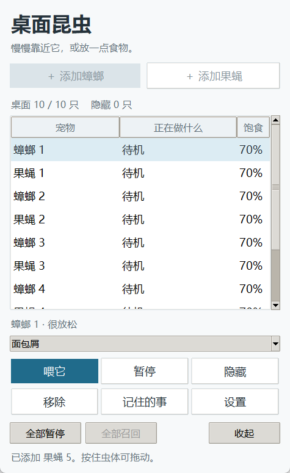

# NeuroPet 2D

拟真的 Windows 蟑螂 / 果蝇桌宠。六足步态、触角探测、清洁身体、觅食和对鼠标的反应；保留原来的 2D 运动，专注轻量桌面体验。

**中文 | [English](README.en.md)**

**[下载 Windows 便携版](https://github.com/lexingtonhibiki/NeuroPet-2D/releases/latest)** · [资源实测](docs/performance.md) · [发布说明](docs/release-notes-v0.1.1.md)



[10 宠连续动作演示](assets/demos/ten-pets.gif)（程序图像，固定 60 Hz 模拟、15 fps 录制；不包含桌面画面）。

## 使用

1. 下载 Release 的 ZIP，解压到可写的文件夹，双击 `NeuroPet-2D.exe`。无需安装 Python。
2. 启动默认是一只蟑螂和一只果蝇。点击 **添加蟑螂 / 添加果蝇**，桌面最多同时显示 **10 只**。旧配置里的 3 宠上限会自动升级。
3. 选中列表中的宠物，直接 **喂它、暂停、隐藏**。隐藏保留记忆，再点 **召回** 即可回来；名额已满会提示。
4. 按住虫体可以拖动。**全部暂停 / 全部继续** 控制整个桌面；列表滚动不会改变选中的宠物。
5. 关闭面板后宠物继续活动。右键系统托盘图标可重新打开面板、放食物或保存退出；托盘不可用时从任务栏恢复。

`Ctrl+1 / Ctrl+2` 添加两种宠物；列表中按空格暂停当前宠物，Esc 收起面板。**设置**可以调整当前宠物的大小、启动面板和界面语言；**记住的事**按需打开。移除只移出当前会话，档案保留；清除记忆会二次确认。

## 语言

界面、设置、记忆窗口与系统托盘菜单都提供 **简体中文 / English**，在 **设置 → 语言** 切换，立即生效并保存，无需重启。首次运行没有语言配置时跟随系统语言：中文系统用中文，其余用英文，检测失败回退中文。切换语言不会打断当前操作：选中的宠物、编号、已选食物、暂停与隐藏状态、已打开的窗口都原样保留，用户自定义的宠物名字不翻译。

**记忆正文保持原文**：宠物自己写下的历史经历是存档内容，不做机器翻译、不重写，因此早期存档在英文界面下仍显示原来的语言。

当前支持 Windows 10/11、主显示器。透明背景可穿透到桌面，虫体保留拖动交互。桌面点击投喂默认 15 秒自动结束，面板内直接投喂无需开启这个模式。

## 存档

`data/` 在 EXE 旁保存配置、宠物名册、隐藏状态和每只宠物的记忆。更新时关闭旧程序，保留这个目录，用新 EXE 替换旧 EXE。可用环境变量 `NEUROPET_DATA_DIR` 指定其他存档目录。

公开源码和发行包包含步态参数，不包含研究目录里的私人存档、日志或 Git 历史。原 NeuroPet 研究目录保持原样。

## 开发 / 打包

需要 Windows 和 Python 3.13（含 tkinter）：

```powershell
python -m venv .venv
.venv\Scripts\python.exe -m pip install -r requirements-dev.txt
.venv\Scripts\python.exe -m neuropet.main
.venv\Scripts\python.exe tools\run_all_tests.py
.venv\Scripts\python.exe tools\build_release.py
```

`start.bat` 使用本地虚拟环境或 PATH 中的 Python；`build_exe.bat` 输出 `dist/NeuroPet-2D/` 便携文件夹。保持 EXE 与 `_internal/` 一起移动，双击 EXE 即可；此打包方式只需要一个常驻进程。运行依赖为 Pillow / pystray，未引入浏览器界面或 3D 驱动。

界面文案集中在 `neuropet/core/i18n.py` 的内置字典（zh-CN / en，无新增第三方依赖）；新增文案加一个 key 即可，两种语言同时给出。`data/config.json` 的 `language` 字段保存用户选择，缺失时按系统语言判定。

测量程序使用一次性存档，不触碰用户数据：

```powershell
.\NeuroPet-2D.exe --probe --pets 10 --seconds 60 --output result.json
python tools\release_probe.py --pets 2 --seconds 60 --output result.json
```

模拟更新与姿态重绘分开；宠物移动不必等待姿态绘制配额。图像缓存按字节淘汰，重叠宠物每帧合成一次；透明显示表面按实际内容调整范围。**60 MiB 是双宠优化目标，实际数据以性能报告为准，10 宠单独计量。** 英文说明见 [README.en.md](README.en.md)；性能报告为中英对照单文件 [docs/performance.md](docs/performance.md)。

MIT。依赖的许可证与源码信息见便携包的 `licenses/`。3D 关节重建留待后续研究。